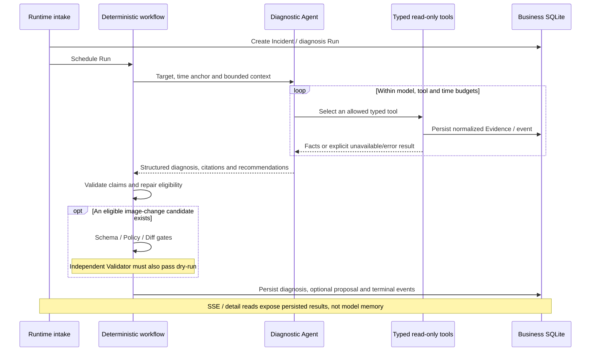
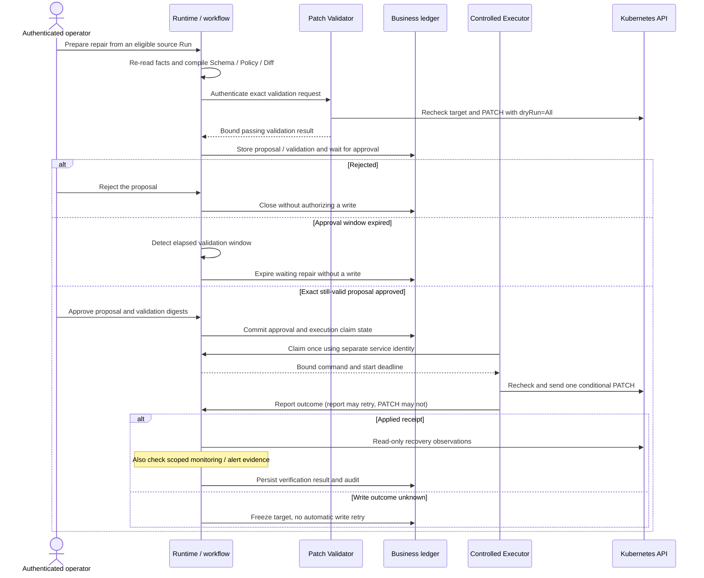

# Architecture

Components, trust boundaries and workflow contracts. See [evaluation and evidence](evaluation.md) for how to interpret validation results.

K8s Incident Agent handles runtime incidents, not general Kubernetes administration or pre-deployment YAML authoring. The product targets supported real Kubernetes environments; the installation profiles are scoped to fixed Kind and single-node K3s sandboxes.

## Components and trust boundaries

The [component diagram in the README](../README.md#architecture) shows the overall topology. The sections below explain its trust boundaries and detailed workflows.

Arrows show allowed communication, not shared authority. Dashed paths belong to the separately gated Executor; execution is disabled by default. The [Executor manifests](../deploy/application/executor/kustomization.yaml) are separate from the current application profiles; their presence is not an installed worker or permission to enable execution.

The browser holds neither kubeconfig nor service-to-service keys and cannot reach Kubernetes, Prometheus or SQLite directly. The BFF handles a fixed upstream, transport/error adaptation and SSE cancellation; it is not an authorization database or an arbitrary URL proxy. FastAPI owns authentication, business state and server-side safety gates.

Within Runtime, LangGraph controls deterministic state transitions. A single LangChain diagnostic Agent selects typed read-only tools inside that workflow. It does not choose whether an approval is valid, execute a patch, or decide to retry an ambiguous write. Kubernetes observations and bounded Prometheus results become persisted Evidence before they support diagnostic claims.

Source: [BFF client](../src/lib/agent-runtime/server-client.ts), [Runtime app](../services/agent-runtime/src/k8s_incident_agent/api.py), [workflow graph](../services/agent-runtime/src/k8s_incident_agent/workflow/graph.py), [supervisor](../services/agent-runtime/src/k8s_incident_agent/workflow/supervisor.py).

## Diagnosis: facts before explanations

Inputs are either a catalog-mapped Alertmanager occurrence or an authenticated manual action enabled by the selected profile. Repeated alert deliveries are deduplicated. A resolved alert updates signal history; it does **not** establish recovery or automatically resolve the Incident.

The diagnostic scope is broader than the executable action set: Pod/Deployment investigation can produce explanations, missing-information findings and manual recommendations without an executable proposal. Evidence of a terminated container with reason `OOMKilled` supports that termination fact. Without a memory trend, it does not establish where memory pressure came from; without the reason, a restart alone is not proof of OOM. CPU throttling alone is not proof that it caused slow startup.

The current default diagnosis budget is 12 model calls, 12 tool calls and 180 seconds, with deterministic final-output budgeting. The model baseline is `deepseek-flash`, non-thinking. Budget exhaustion and unavailable evidence remain explicit, not synthetic success. Locked configuration and tool policy—not scenario names—control the production path.

Monitoring uses the versioned [catalog](../monitoring/catalog/catalog.json) for alert routing, bounded queries and UI panels. Historical runs use their time anchor and resource identity rather than treating today's metrics as past evidence. Current K3s resource/probe collection and its shared-node limits are described in [security](security.md#monitoring-and-sensitive-data). Monitoring is not a general-purpose arbitrary-PromQL dashboard.

## Repair: preparation is not execution

Diagnosis and repair are different Run kinds. A repair Run records its source Run, revalidates current facts and prepares an exact candidate; the UI may show the referenced diagnosis without pretending a second diagnosis occurred. A recommendation is not executable just because it suggests an action. Current eligibility is limited to evidence-bound Deployment container-image replacement, including an explicitly prepared rollback to the recorded prior image.

The diagram shows the passing-validation path and selected execution outcomes, not every rejection branch or proof of a deployed execution loop. Failed validation cannot enter approval waiting. Rejection, staleness and expiry are distinct outcomes. Approval is valid only within the validation window (15 minutes from validation, not a fresh 15 minutes from the click); execution also has a short start deadline. Successful dry-run does not reserve a resource version. Successful PATCH does not prove recovery. A failed recovery does not trigger automatic rollback: rollback needs its own proposal, validation and approval.

Schema/Policy/Diff failures do not become a valid proposal. A persisted validation record describes what was checked, not a guarantee that cluster state still matches. `UNKNOWN` remains frozen for explicit investigation; refreshing a page, retrying a request or restarting Runtime must not resend the write.

Source: [repair preparation](../services/agent-runtime/src/k8s_incident_agent/repair/preparation.py), [Validator](../services/agent-runtime/src/k8s_incident_agent/repair/validator.py), [execution worker](../services/agent-runtime/src/k8s_incident_agent/execution/worker.py), [recovery verification](../services/agent-runtime/src/k8s_incident_agent/repair/verification.py).

## Persistence and deployment limits

The business ledger is authoritative for Incident, Run, Evidence, approvals and execution/recovery audit. A separate LangGraph checkpoint database stores resumable workflow progress, not a second authority for authorization. Run IDs connect them at the application layer; there is no cross-database foreign key. See the [schema and known discrepancy](data-model.md).

Current deployment is a single Runtime with SQLite, not a multi-tenant or horizontally scaled control plane. Kind supports development and CI; fixed K3s is the first installable demonstration target. Authentication and an isolated execution implementation do not establish production support, public HTTPS readiness or arbitrary-cluster compatibility. See [selected decisions](decisions/README.md) for why these boundaries exist.
