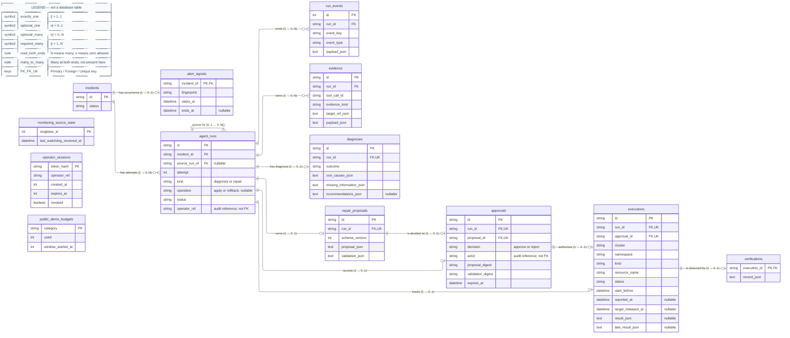

# Data model

The business schema targets migration `20260919_0013`: 13 business tables plus Alembic metadata. The diagram describes the schema, not the migration state or contents of an installation.

Authority: [ORM models](../services/agent-runtime/src/k8s_incident_agent/persistence/models.py), [migration history](../services/agent-runtime/migrations/versions), and [repository invariants](../services/agent-runtime/src/k8s_incident_agent/persistence/repositories.py). The diagram shows all 13 business tables with selected columns and **actual database foreign keys**, not every field or application-level association. `PK`, `FK` and `UK` mean primary key, foreign key and individually unique key; compound uniqueness is listed separately.

## Business schema

The dashed legend box explains notation; it is not a fourteenth table. Read the markers at **both** ends: `||` means exactly one, `o|` means zero or one, and a fork means many. Relationship labels also spell out the same cardinality numerically. No many-to-many association table exists in this schema.

## Incidents, runs and evidence

Each FK-linked child has exactly one parent except the optional `source_run_id`: a Run may have no source, and a source may be referenced by multiple later Runs. Parent records may exist without any child yet; the diagram does not require every Run to have a diagnosis, proposal or events.

| Database constraint | Meaning |
| --- | --- |
| Unique `(incident_id, attempt)`; `attempt >= 1` | Stable per-Incident attempt numbering |
| Partial unique `incident_id` for `QUEUED`, `RUNNING`, `WAITING_APPROVAL` | At most one active Run per Incident |
| Unique `(fingerprint, starts_at)` | One stored alert occurrence despite repeated delivery |
| Unique `(run_id, event_key)` | Idempotent event recording |
| Unique `(run_id, tool_call_id)` | One Evidence record per tool call |
| Run-kind CHECK | Diagnosis has model configuration and no repair operation; repair has apply/rollback but no model configuration or model/token counters; diagnosis cannot wait for approval |
| Alert CHECK | Firing has no end time; resolved has an end time not before its start |

Repositories add rules beyond those FKs: source and child belong to the same Incident, the source attempt is earlier, and rollback must reference an eligible executed apply Run. Do not infer these guarantees from the self-reference alone.

`recommendations_json = NULL` means a historical Run predates generated recommendations; it is not equivalent to an empty recommendation list. Diagnosis outcomes distinguish `diagnosed` from `insufficient_evidence`; a fluent summary does not erase missing facts.

## Exact approval, execution and recovery

There is at most one proposal, decision and execution per Run; these are optional records, not compulsory pipeline steps. A rejection is a stored decision, not permission to execute. The repository checks same-Run consistency, exact digests, approval expiry and allowed transitions; separate FKs alone do not enforce them.

The execution ledger has a partial unique index on `(cluster, namespace, kind, resource_name)` **while `target_released_at IS NULL`**. Occupancy is not just a test for a running status: an ambiguous outcome or a failed recovery can retain it. The release CHECK permits release only for `EXPIRED`, or reported `APPLIED` / `REJECTED` / `STALE_RESOURCE`; that is a necessary condition, not an instruction to release every such record. `UNKNOWN` cannot release the target or authorize an automatic retry.

Execution statuses are `PENDING`, `CLAIMED`, `APPLIED`, `EXPIRED`, `STALE_RESOURCE`, `REJECTED` and `UNKNOWN`. Verification has its own JSON record; an `APPLIED` receipt is not a recovery result. Rollback is a new repair Run with a fresh approval, not deletion or rewriting of the original audit history.

## Standalone business tables

These three tables have **no foreign keys** and are intentionally not attached to the ER with invented relationships.

| Table | Primary key | Purpose / constraint |
| --- | --- | --- |
| `monitoring_source_state` | `singleton_id` | Watchdog reception state; singleton CHECK requires `1` |
| `operator_sessions` | `token_hash` | Revocable, expiring operator sessions; 64-character hash, expiry after creation |
| `public_demo_budgets` | `category` | Nonnegative public-read counter and window start; current consumer is `reads` (600 requests per 60-second window), not anonymous model or Run credit |

There is no guest account, guest session, guest ownership or anonymous business-action budget table. `agent_runs.operator_ref` and `approvals.actor` are audit strings, not FKs to a session that can expire. An active session is checked when authorization is required.

## References that are not foreign keys

- Evidence IDs inside diagnosis, recommendation and proposal JSON are checked by application contracts; there is no diagnosis–Evidence join table.
- `proposal_json.change.source_execution_id` links a rollback to its source execution through repository validation, not a database column/FK.
- Proposal and validation JSON include Run references and digests; these do not create extra relational edges.
- The schema declares no FK delete cascade. Cleanup requires explicit lifecycle logic; do not infer safe cascading deletion from an ER line.

## Workflow checkpoint separation

[Runtime paths](../services/agent-runtime/src/k8s_incident_agent/runtime/paths.py) keep `incidents.sqlite3` and `checkpoints.sqlite3` separate. SQLAlchemy/Alembic owns the business schema and [enables SQLite foreign keys](../services/agent-runtime/src/k8s_incident_agent/persistence/database.py). LangGraph's [checkpoint integration](../services/agent-runtime/src/k8s_incident_agent/workflow/checkpoint.py) uses its own schema and disables pickle fallback. Its internal tables are not business entities above.

The application uses a Run ID as checkpoint `thread_id`; there is no cross-database FK or atomic business/checkpoint transaction. The supervisor reconciles resumable progress with the authoritative business ledger. A checkpoint alone cannot grant approval or establish that a Kubernetes write succeeded.

## Known schema discrepancy

[Migration `20260914_0011`](../services/agent-runtime/migrations/versions/20260914_0011_explicit_rollback.py) adds `ROLLED_BACK` to the Incident status CHECK. The ORM's explicit Incident CHECK still omits it, while the domain and repository use this status. Therefore ORM-created schemas and migrated schemas are not fully equivalent. Use the documented Alembic migration path; these diagrams describe the migration target, not `metadata.create_all()` as a supported installation method. This documentation change does not repair that existing mismatch or inspect any retained database.
