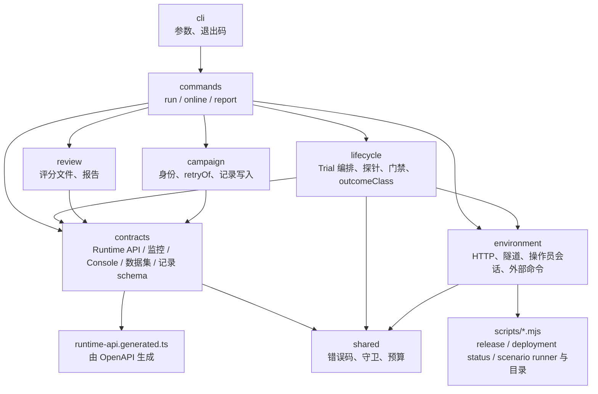

# 评估模块

本目录是 K8s Incident Agent 评估线的 TypeScript 模块。评估在固定 Kind / K3s 沙箱中用版本化数据集驱动真实故障场景，经真实 Runtime 链路取得诊断结果并做确定性检查；评估命令、产物与报告的语义见 [`scripts/README.md`](../scripts/README.md) 的评估一节。

## 工具链

- 代码由 Node.js 24 直接运行（原生类型剥离），没有构建步骤：只使用可擦除的 TypeScript 语法（无 `enum`、`namespace` 与参数属性），模块内 import 带 `.ts` 扩展名，类型导入使用 `import type`。
- `package.json` 只声明 `"type": "module"`，为 TypeScript 与 Node 提供 ESM package scope；`tsconfig.json` 是模块自己的类型检查配置，仓库根 `tsconfig.json` 排除本目录。
- 类型检查：`npx tsc -p evaluation/tsconfig.json --noEmit`；测试：`node --test "evaluation/test/**/*.test.ts"`；lint 由仓库根的 `npm run lint` 覆盖。
- `src/contracts/runtime-api.generated.ts` 由 `npm run openapi:generate` 从 `contracts/agent-runtime.openapi.json` 生成，与 Console 的生成类型同源同版本；`npm run openapi:check` 同时比较两份。

## 目录

| 目录 | 职责 |
| --- | --- |
| `datasets/` | 版本化数据集清单：Case、split、机制、来源组、预期终态、告警等待预算 |
| `src/shared/` | 错误类型与错误码表、`safeFailure`、字符串 / UUID / 时间守卫、`canonicalJson`、等待预算与 `waitUntil` |
| `src/contracts/` | 外部边界：Runtime API 读取器与运行时校验（`runtime-api.generated.ts` 是生成的类型）、Prometheus / Alertmanager 与 Console 的读取形状、数据集清单与评估投影、artifact / 评分包 / 评分文件 / 报告的记录 schema |
| `test/` | 与 `src` 同构的 `node:test` 测试；`test/support` 是共享 fixture；`test/fixtures/golden` 是记录样本 |

## 分层契约

依赖只向下：`commands` 依赖 `lifecycle` / `campaign` / `review`，也直接使用 `environment` 与 `contracts`；`lifecycle` / `review` / `campaign` 依赖 `contracts` 与 `environment`；`contracts` 与 `environment` 只依赖 `shared`、生成类型和 `scripts/` 的明确导出。所有外部形状在 `contracts` 校验一次并归一化，其余代码只消费类型化对象；`scripts/*.mjs` 不 import 本模块。

错误码：模块自身抛出的错误码在 `src/shared/errors.ts` 的 `EVALUATION_ERROR_CODES` 中穷举，`EvaluationError` 只能携带表中的码或经环境层归一化的脚本错误码；未知错误经 `safeFailure` 折叠为 `evaluation_failed`，不携带上游内容。
