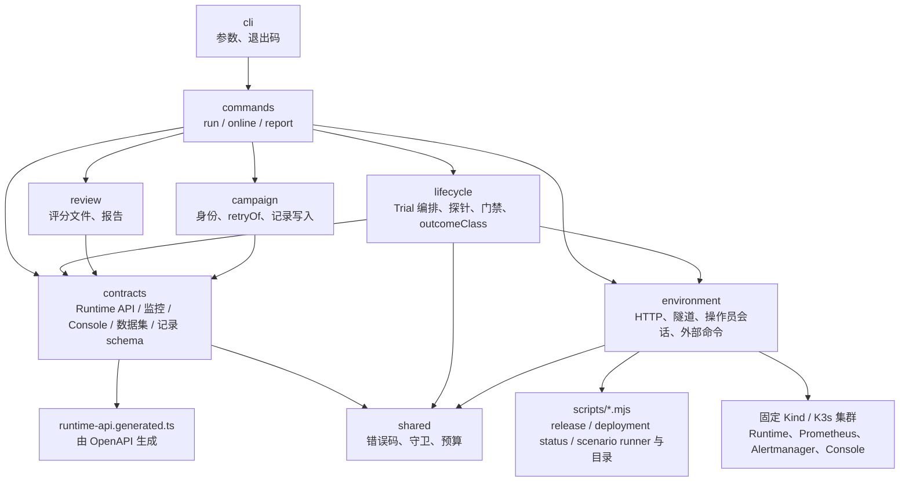
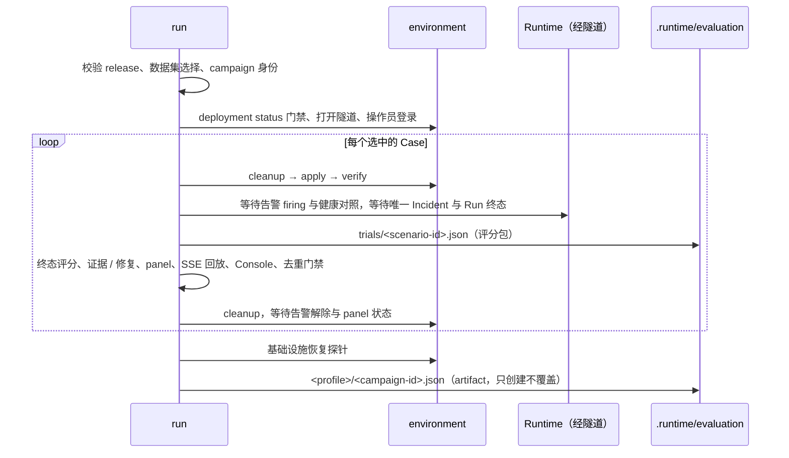

# 评估模块

本目录是 K8s Incident Agent 的评估模块：用版本化数据集驱动固定 Kind / K3s 沙箱中的真实故障场景，经真实 Runtime 链路取得诊断结果，做确定性检查，并把每次尝试的记录、供人工审阅的评分包与人工评分绑定成可追溯的 campaign 报告。它是场景 harness 与记录系统，不是自然语言质量评分器；`pending_manual_review` 是自动检查通过后的状态，不是语义 PASS。

## 命令

```bash
npm run evaluation -- run kind-evaluation --release <release.json> [--dataset <manifest.json>] [--split development|regression] [--scenario <id> ...] [--retry-of <campaign-id>]
npm run evaluation -- run k3s-evaluation --context <context> --release <release.json>
npm run evaluation -- online k3s-public --context <context> --release <release.json>
npm run evaluation -- report .runtime/evaluation/<profile>/<campaign-id>.json
npm run evaluation-report -- .runtime/evaluation/<profile>/<campaign-id>.json
```

评估入口不接受任意 URL、Namespace、manifest、PromQL、artifact 路径或 kubectl 参数。Kind 只使用固定 context；K3s 必须显式提供经过 deployment status 门禁的 context；`k3s-public` 只能执行 `online`。命令会在本机回环建立 Runtime、Console、Prometheus 与 Alertmanager 的固定临时 port-forward，完成后关闭。

`run` 有精确的 live 副作用：应用并清理场景 fixture、重建固定 Pod、轮换 Webhook Secret、受控缩放监控组件；须在用户授权后运行。它不会 install / uninstall、purge、删除 Namespace / PVC / PV / Secret，也不修改 cert-manager 与兄弟项目资源。`online` 只做只读 API 与 Console 边界检查。`report` 只读本地记录，`evaluation-report` 是它的别名。

退出码：`run` 与 `online` 产出产物时在 stdout 打印一行 JSON 摘要（`status`、`profile`、`artifact`），`passed` 退出 `0`，`pending_manual_review` 退出 `2`，其余退出 `1`；未能产出产物时 stderr 输出一行 `FAIL <code> <message>` 并退出 `1`。`report` 生成成功退出 `0`，结论在 JSON 的 `status` 与各 Case 的 `review` 中；不能生成时 `FAIL <code> <message>` 退出 `1`。

命令在任何 live 副作用前通过共享的 `scripts/release.mjs` loader 校验显式选择的 `--release <release.json>`：当前 Git worktree 必须干净，HEAD 与 manifest 的 `sourceRevision` 完全一致；两组件 OCI 的 index、manifest、config 和全部 layer 均检查 size / digest，且恰有 linux/amd64、linux/arm64 两个平台、同 source、非 root。应用镜像身份只来自该 manifest，相同的已验证 manifest 传给 deployment status 及 scenario 的 K3s preflight，不重复选择另一份镜像身份。

## 工具链

- 代码由 Node.js 24 直接运行（原生类型剥离），没有构建步骤：只使用可擦除的 TypeScript 语法（无 `enum`、`namespace` 与参数属性），模块内 import 带 `.ts` 扩展名，类型导入使用 `import type`。
- `package.json` 只声明 `"type": "module"`，为 TypeScript 与 Node 提供 ESM package scope；`tsconfig.json` 是模块自己的类型检查配置，仓库根 `tsconfig.json` 排除本目录。
- 类型检查：`npx tsc -p evaluation/tsconfig.json --noEmit`；测试：`node --test "evaluation/test/**/*.test.ts"`；两者都包含在仓库根的 `npm test` 中，lint 由根 `npm run lint` 覆盖。
- `src/contracts/runtime-api.generated.ts` 由 `npm run openapi:generate` 从 `contracts/agent-runtime.openapi.json` 生成，与 Console 的生成类型同源同版本；`npm run openapi:check` 同时比较两份。

## 目录

| 目录 | 职责 |
| --- | --- |
| `datasets/` | 版本化数据集清单：Case、split、机制、来源组、预期终态、告警等待预算 |
| `src/cli.ts` | 参数解析、命令分发、退出码与 `FAIL` 输出 |
| `src/shared/` | 错误类型与错误码表、`safeFailure`、字符串 / UUID / 时间守卫、`canonicalJson`、等待预算与 `waitUntil` |
| `src/contracts/` | 外部边界：Runtime API 读取器与运行时校验（`runtime-api.generated.ts` 是生成的类型）、Prometheus / Alertmanager 与 Console 的读取形状、数据集清单与评估投影、artifact / 评分包 / 评分文件 / 报告的记录 schema |
| `src/environment/` | HTTP 传输（有界读取、超时、SSE 流读取）、固定 port-forward 隧道与端点、操作员会话（登录、Cookie / CSRF、只对读重试）、外部命令适配（kubectl、scenario runner、deployment status、release 读取） |
| `src/lifecycle/` | 单个 Trial 的执行编排（cleanup → apply → verify → 告警 → 对照 → Incident → 终态 → 评分包抓取 → 门禁 → 去重 → cleanup → 解除）、基础设施恢复探针、评分包抓取，以及不做 I/O 的门禁（终态与三种预期的校验、证据与工具权限、ImagePull 修复 proposal 的证据绑定校验、panel 风险、SSE 事件契约与终态序列、单 Run 去重、解除判定）、outcomeClass 分类、覆盖报告与完整计划分母 |
| `src/campaign/` | campaign 身份与 `--retry-of` 校验、`.runtime/evaluation` 下的记录写入与读取（campaign 产物与评分包只创建不覆盖，online 产物临时文件 + 原子改名） |
| `src/review/` | 评分文件校验、评分包绑定与 `retryOf` 链，campaign 报告生成 |
| `src/commands/` | `run`（数据集选择、campaign 规划、deployment status 门禁、隧道与登录、逐 Case 评估、探针、产物组装）、`online`（公开边界：只读路由集合、Console 首页、匿名重跑拒绝、已认证重跑的三种合法结果）、`report`（参数校验后生成报告） |
| `test/` | 与 `src` 同构的 `node:test` 测试；`test/support` 是共享 fixture 与按 Runtime / 监控 / Console / 集群命令拆分的假环境；`test/fixtures/golden` 是记录样本 |

## 分层契约



依赖只向下：`cli` 只依赖 `commands` 与 `shared`；`commands` 依赖 `lifecycle` / `campaign` / `review`，也直接使用 `environment` 与 `contracts`；`lifecycle` / `review` / `campaign` 依赖 `contracts` 与 `environment`；`contracts` 与 `environment` 只依赖 `shared`、生成类型和 `scripts/` 的明确导出（release manifest、deployment status、scenario runner 与已校验的场景目录）。Runtime API / 监控 / Console / 数据集 / 记录的外部形状在 `contracts` 校验一次并归一化，`environment` 只校验它自己消费的登录响应与命令输出，其余代码只消费类型化对象；`scripts/*.mjs` 不 import 本模块。

错误码：模块自身抛出的错误码在 `src/shared/errors.ts` 的 `EVALUATION_ERROR_CODES` 中穷举，`EvaluationError` 只能携带表中的码或经环境层归一化的脚本错误码；未知错误经 `safeFailure` 折叠为 `evaluation_failed`，不携带上游内容。

## 一次 campaign 做什么



`run` 复用场景目录已校验的私有评估投影，逐 Case 证明健康基线、真实 Prometheus / Alertmanager firing、健康对照不触发、唯一 Incident / Run、Run 终态与 Case 的预期一致、Evidence 及其引用、必要 panel、具备完整 lifecycle payload 的 SSE replay、Console 稳定详情、目标 Incident 自身的重复投递去重和 resolved 信号。场景彼此独立执行；单项失败会保留固定错误分类并继续后续 Case。重复投递按目标 Incident 的 `updatedAt` 推进判断，不使用可能被 Watchdog 等其他告警污染的全局 webhook 计数。最后还会受控缩放并恢复 kube-state-metrics / Prometheus，以验证 stale 与 monitoring unavailable 状态，然后轮换两个 Namespace 的同值 Webhook Secret、重建 Runtime 与 Alertmanager，并要求 Watchdog 接收时间严格推进后再次证明链路健康。

每个 Case 在数据集中声明预期终态：`diagnosed` 要求 Run COMPLETED 且给出引用 Evidence 的根因；`insufficient_evidence` 要求 Run COMPLETED、没有根因并列出缺少的信息；`failed` 要求 Run 以指定的 `error_code` FAILED（只覆盖在 repair proposal 之前失败的 Run）。三者都要求 SSE replay 持久化对应的终态事件（`diagnosis.completed`、`diagnosis.insufficient` 或 `run.failed`）。预期的失败被正确处理时自动检查通过；终态与预期不符时以 `terminal_outcome_mismatch` 失败。结果中的 `checks.run` 始终记录 Runtime 自己的 attempt、状态、错误码与诊断 outcome，不按预期改写。评分包在终态确定后、终态评分之前抓取，所以错配的终态同样有评分包可审。每个结果带 `outcomeClass`：`infrastructure_invalid`（Alertmanager firing 之前的 fixture、监控或对照失败，输入尚未交付给 Runtime）、`intake_failed`（告警已 firing 但 Runtime 未产生唯一 Incident，或健康对照误报）、`run_not_terminal`（Run 在预算内未结束）、`outcome_mismatch`、`contract_failed`（终态之后的门禁失败）、`pending_manual_review` 或 `not_run`。

`online` 证明公开 profile 的只读边界：Runtime 不暴露场景目录与人工创建 Incident 的路由，Console 首页没有创建入口，匿名重跑被认证拒绝，已认证重跑只可能得到 Runtime 自身状态能解释的三种结果之一（已接受并产生新的 operator Run、已有活动 Run、诊断不可用且 `/healthz` 如此报告）。

## 记录布局

```text
.runtime/evaluation/
  <profile>.json                          online 边界产物（schema 2，原子覆盖）
  <profile>/<campaign-id>.json            campaign 产物（schema 4，只创建不覆盖）
  <profile>/<campaign-id>/trials/<scenario-id>.json   评分包：Incident 详情投影 + Run 事件历史（schema 1，紧凑 JSON，按落盘字节 ≤ 4 MiB）
  <profile>/<campaign-id>/reviews/*.json  人工评分（schema 1）
```

每次 `run` 是一个 campaign，身份为开始时间加随机后缀（如 `20260905T000000Z-1a2b3c4d`），可用 `--retry-of <campaign-id>` 声明它复测的是同 profile、同数据集的哪一次 campaign。同一身份再次写入会以 `evaluation_artifact_exists` 失败，早先的记录与其他数据集版本的记录都不会被改动。artifact 包含所选 release manifest、数据集与 campaign 身份、每个 Case 的 Trial 时间、布尔检查、状态、`outcomeClass`、计数、Evidence kind、诊断 code 和 panel ID；不包含 Secret、token / hash、原始 Evidence、模型陈述、Event note、日志、上游响应或任意凭据。

每个到达终态的 Trial 另外保存评分包：经同一已认证会话读取的 Incident 详情投影（含 Runtime 安全投影后的诊断陈述、Evidence payload 与 repair proposal）和该 Run 的事件历史，以紧凑 JSON 原样落盘、不再加工；超限时丢弃事件历史并标 `truncated`。评分包不含 Cookie、CSRF token、密码、请求头或原始日志，只供指定维护者本地人工审阅。目录 / 文件权限为 `0700` / `0600`，`.runtime/` 不入库。

人工评分文件字段：`schemaVersion`、`campaignId`、`scenarioId`、`trial`、`runId`、`rulesVersion`、`reviewer`、`reviewedAt`、`verdict`（`pass` / `fail` / `insufficient_to_score`）、`reasons`、`evidenceIds`。评分不改变任何 Runtime 状态或 artifact。`report` 只读 artifact、评分包与评分文件，逐 Case 给出自动状态、`outcomeClass` 与评分结论：没有评分为 `pending_manual_review`；多份评分结论不一致为 `disagreement`；评分绑定的 campaign / trial / runId 与记录不符、引用的 Evidence 不在评分包中、评分包缺失或损坏、同一 campaign 出现不同 `rulesVersion` 时为 `incomplete`；自动门禁失败或未运行的 Case 不接受人工晋级。报告还沿 `retryOf` 列出复测链；它是只读视图，退出码只反映报告能否生成。

## 数据集

`datasets/regression-v1.json` 是当前唯一清单。Case 复用场景目录中的 scenario id / revision，记录 `split`、`mechanism`、`source_group`、`expected_terminal`、`profiles` 与 `alert_wait_seconds`；跨 split 重用同一来源组会被拒绝；已公开的场景目录不能标记为 holdout。私有 oracle 是各场景 `scenario.json` 中的 `expected_root_causes`，只进入评估投影，不进入 Runtime、Prompt 或 API。

## 边界

- 只经现有 port-forward 与操作员会话访问 Runtime，不读取 Runtime 数据库、Secret 或 kubeconfig。
- Kind 只用固定 context；K3s 须显式 `--context` 并先通过 deployment status 门禁。
- 不改变场景目录、告警规则、诊断预算或任何 Runtime 行为。
